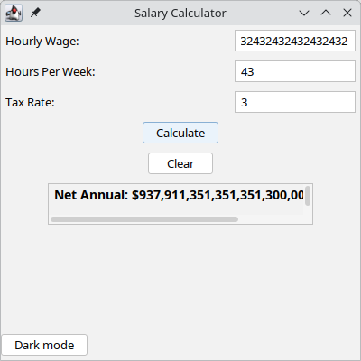

# Gross to Net Income Calculator (Java Swing GUI)
This Java Swing GUI application helps users calculate their **net income** from their **gross income** by accounting for tax rates

## Features
- Use-friendly GUI built with Java Swing
- Caclulates net income based on gross income and tax rate
- Allows customization of tax percentage

## Screenshot

## Requirements
- **Java 8** or higher

## Installation

**Linux/MacOS**
do ./build-java.sh to build program
do ./run-java.sh to run program

## Error Handling
The program takes several factors into consideration when running, and it includes handling for common exceptions:

### Invalid Input
**Problem**: Non numeric input
**Solution**: Ensure that you enter valid numeric values for all 3 fields

**Problem**: Negative inputs
**Solution**: Ensure that you enter valid numeric values greater than **0**
